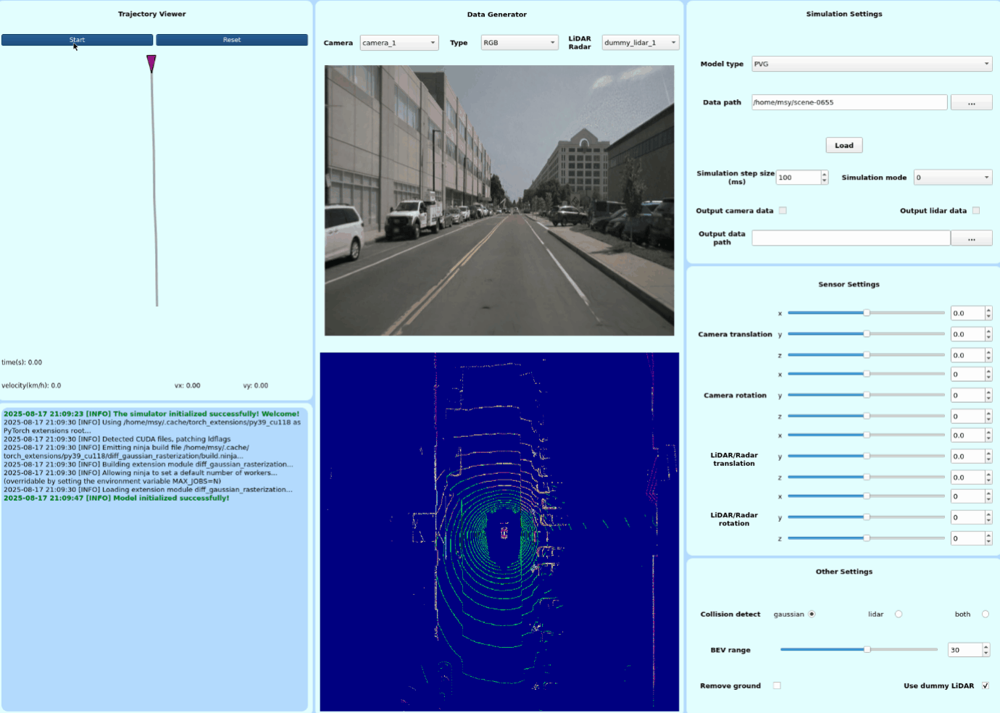
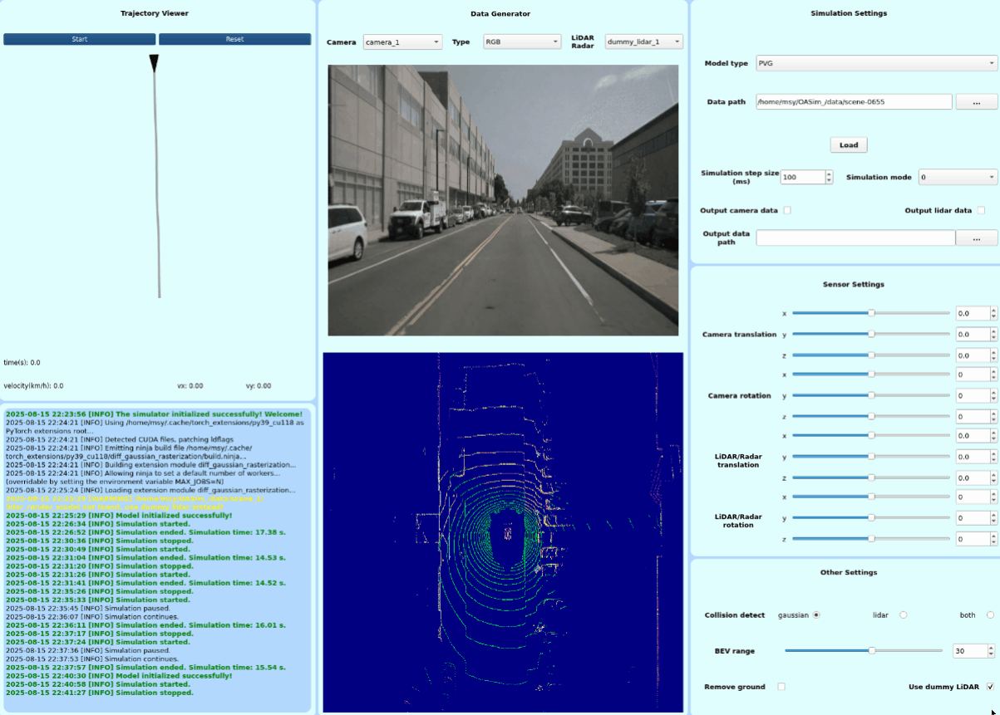

# EGSIM: An End-to-End Gaussian Splatting-Based Autonomous Driving Real-Scene Simulator

## 🔍 Framework Overview

EGSIM is an end-to-end real-scene simulator for autonomous driving based on 3D Gaussian Splatting (3DGS). It can simulate a variety of sensors such as cameras, LiDAR, and radar, and the specific types of sensor modalities it supports are determined by the rendering models integrated by users. Meanwhile, it adopts a modular and extensible design, providing interfaces for rendering models to facilitate users in replacing or customizing these components. On this basis, EGSIM can build a complete end-to-end closed-loop simulation system and is also equipped with a user-friendly visualization interface, which is used for configuring simulation parameters and displaying simulation data.

## 🎥 Demonstrations

### 1. Simulation Process

<div style="display: flex; justify-content: center; gap: 10px; margin: 0 0;">
  <div style="text-align: center;">
    
    <p style="margin-top: 8px;">RGB (based on <a href="https://github.com/fudan-zvg/PVG">PVG</a>)</p>
  </div>
  
  <div style="text-align: center;">
    
    <p style="margin-top: 8px;">Depth (based on <a href="https://github.com/fudan-zvg/PVG">PVG</a>)</p>
  </div>
</div>

<div style="display: flex; justify-content: center; gap: 10px; margin: 0 0;">
  <div style="text-align: center;">
    
    <p style="margin-top: 8px;">Ground Removal Demo 1 (based on <a href="https://github.com/LimHyungTae/patchwork">Patchwork</a>)</p>
  </div>
  
<div style="text-align: center;">
    
    <p style="margin-top: 8px;">Ground Removal Demo 2 (based on <a href="https://github.com/LimHyungTae/patchwork">Patchwork</a>)</p>
  </div>
</div>

<div style="display: flex; justify-content: center; gap: 10px; margin: 0 0;">
  <div style="text-align: center;">
    
    <p style="margin-top: 8px;">5 Camera Switching (Waymo)</p>
  </div>
  
  <div style="text-align: center;">
    
    <p style="margin-top: 8px;">6 Camera Switching (nuScenes)</p>
  </div>

  <div style="text-align: center;">
    
    <p style="margin-top: 8px;">5 Radar Switching (nuScenes)</p>
  </div>
</div>

### 2. Collision Detection

<div style="display: flex; justify-content: center; gap: 10px; margin: 0 0;">
  <div style="text-align: center;">
    
    <p style="margin-top: 8px;">Foreground Collision</p>
  </div>
  
  <div style="text-align: center;">
    
    <p style="margin-top: 8px;">Background Collision</p>
  </div>
</div>

### 3. 6-DoF Sensor Pose Transformation

<div style="display: flex; justify-content: center; gap: 10px; margin: 0 0;">
  <div style="text-align: center;">
    
    <p style="margin-top: 8px;">Camera</p>
  </div>
  
  <div style="text-align: center;">
    
    <p style="margin-top: 8px;">LiDAR</p>
  </div>
</div>

### 4. Closed-loop Simulation

<div style="text-align: center;">
  
</div>

## 🛠️ Preparations

### Preparation for Simulator

Follow the steps below to set up the EGSIM simulator environment. 

#### 1. Clone the repository

Clone the project with all its submodules:

```bash
git clone --recursive https://github.com/Meng717/EGSIM.git
```

#### 2. Set up the Conda environment

`cd` to the project directory and create the Conda environment using the provided configuration file:

```bash
cd EGSIM
conda env create -f environment.yml
conda activate egsim
```

#### 3. (Optional) Build the Patchwork module for LiDAR ground point removal

If you want to remove the LiDAR ground points, you need to build the Patchwork module we provided in `patchwork`:

```bash
cd patchwork
mkdir build && cd build
cmake ..
make -j8
```

This will generate a `.so` file inside the build folder. Don't forget to add the build folder path to the project configuration file `configs/include_path.yaml`

After these steps, the EGSIM GUI should be able to run. It should be noted that since we have provided compiled binary files for some codes, **please configure and run the simulator according to the versions specified in the `environment.yml`**. The code has not been fully tested on other versions.

---

### Preparation for rendering models

In the released code, we provide implementations of four rendering models: 3DGS based on [Gsplat](https://github.com/nerfstudio-project/gsplat), [PVG](https://github.com/fudan-zvg/PVG), [GS-LiDAR](https://github.com/fudan-zvg/GS-LiDAR), and [Street Gaussians](https://github.com/zju3dv/street_gaussians). For the preparation of these rendering models, you can refer to the corresponding tutorials. 

PVG and GS-LiDAR can run directly after the environment configuration is completed. If you want to test Street Gaussians model, follow the steps below:

1. Open the file `configs/include_path.yaml` and add the path to your Street Gaussian model working directory.

2. In `/path/to/your/streetgaussian/lib/config/config.py`, locate line 151 and replace it with the following line:

```python
parser.add_argument("--config", default="/path/to/your/streetgaussian/dataset/configs/config_000000.yaml", type=str)
```

3. Change the path in `/path/to/your/streethaussian/dataset/configs/config_000000.yaml` to the corresponding path on your computer.

***Note: After completing the configuration above, the model path selection in the EGSIM GUI only determines the directory used for LiDAR rendering. The actual Street Gaussian model directory cannot be selected through EGSIM GUI. Instesd, you should modify line 151 in `/path/to/your/streetgaussian/lib/config/config.py`.***

---

### Preparation for data

We provide two datasets: one is trained based on PVG and GS-LiDAR, mainly used to demonstrate multi-sensor switching and rendering; the other is trained based on Street Gaussians, mainly used to demonstrate the 6-DoF transformation of cameras. You can download the datasets [here](https://pan.baidu.com/s/1hTkG_4tJwXoxrIqL8_YDtQ?pwd=cb9a). In addition, after being fully open-sourced, we will also support self-made datasets and demonstrate more functions.

## 🚀 Getting Started

After completing the preparation, you can launch the simulator by running:

```bash
python main.py
```

***Note: During the first run, some dependencies may need to be compiled, so the model loading process may experience lag or become unresponsive. Please be patient and wait.***

## 🙏 Acknowledgements

- [OASim](https://github.com/PJLab-ADG/OASim)

- [PVG](https://github.com/fudan-zvg/PVG)

- [GS-LiDAR](https://github.com/fudan-zvg/GS-LiDAR)

- [Gsplat](https://github.com/nerfstudio-project/gsplat)

- [Street Gaussians](https://github.com/zju3dv/street_gaussians)

- [Patchwork](https://github.com/LimHyungTae/patchwork)
